# NNN Premium Car Rental Project  

This is the frontend component for the **NNN Premium Car Rental** website, developed as part of the **2110423 Software Engineering curriculum**.  

###### Our backend repository can be found [here](https://github.com/ILFforever/SE-NNN-CarRental-BE).  

## Overview  
- The frontend can be accessed at [se-cedt-rentals.vercel](https://se-cedt-rentals.vercel.app/), where it is hosted on **Vercel.app**.  
- This project was developed using **TypeScript** and **JavaScript** over a span of approximately **one month _(March 24 to April 30, 2025)_**, in compliance with **Chulalongkorn University’s deadline**.  

## Features  
A **comprehensive system** for **hosting, renting, and managing** car rentals.  

### **User Features**  
- Catalog with **advanced filtering** by tags and price.  
- **User Tier System** with tier-based discount calculations.  
- **Car listings** with detailed information and a **photo gallery**.  
- Provider review system (**star-based ratings**).  

### **Provider Features**  
- **List vehicles** with detailed **features and images** (hosted on a cloud bucket).  
- Add **extra services** to vehicles.  
- **Manage ongoing car rentals** using the **Provider Dashboard**.  
- Oversee **statistics and earnings** using the **Business Dashboard**.  

### **Management Features**  
- Manage **user accounts**, including **verification and tier-based privileges**.  
- Approve, oversee, and manage **car rental providers** registered in the system.  
- Add, edit, and remove **vehicles** listed in the rental catalog.  
- Manage **additional rental services** (insurance, roadside assistance, extra features).  
- Oversee **payment histories**, refunds, and financial transactions.  
- Monitor all rentals, **confirm reservations**, and manage cancellations or disputes.

### **Etc.**  
- **QR Code** generator for topping up funds.  
- **Interactive and responsive web design** for both mobile and desktop devices.  
- **Carousel for showing popular cars** using a weighted algorithm.  
- List **favorite cars** for later use.  

---
## Mock Accounts  
Feel free to create a **new account** or use one of these **mock accounts** to access NNN Rentals.  

| Username         | Email                        | Role      | Tier   | Status    |
|-----------------|----------------------------|----------|--------|-----------|
| user6           | user6@gmail.com             | User     | Bronze   | Active    |
| Playwright Man  | playwright@gmail.com        | User     | Platinum | Active    |
| Admin_Provider  | admin@gmail.com             | Provider | N/A    | Verified  |
| Temp Provider   | playwright.temp@gmail.com   | Provider | N/A    | Pending   |
| Admin           | admin@gmail.com             | Admin    | N/A    | Active    |

---
## Screenshots

  
Landing and User Pages

    
  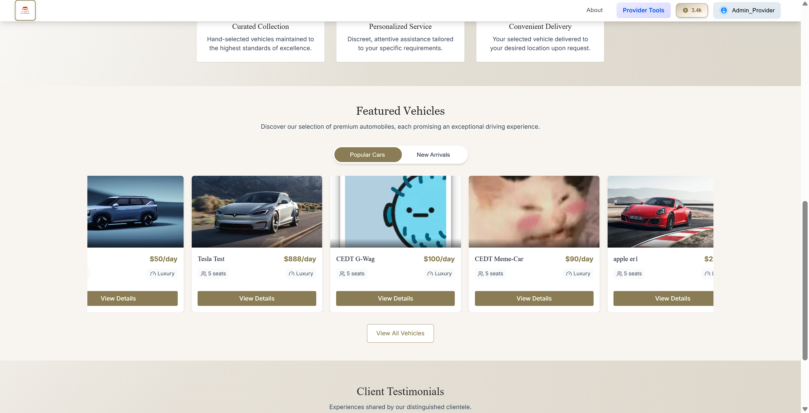  
  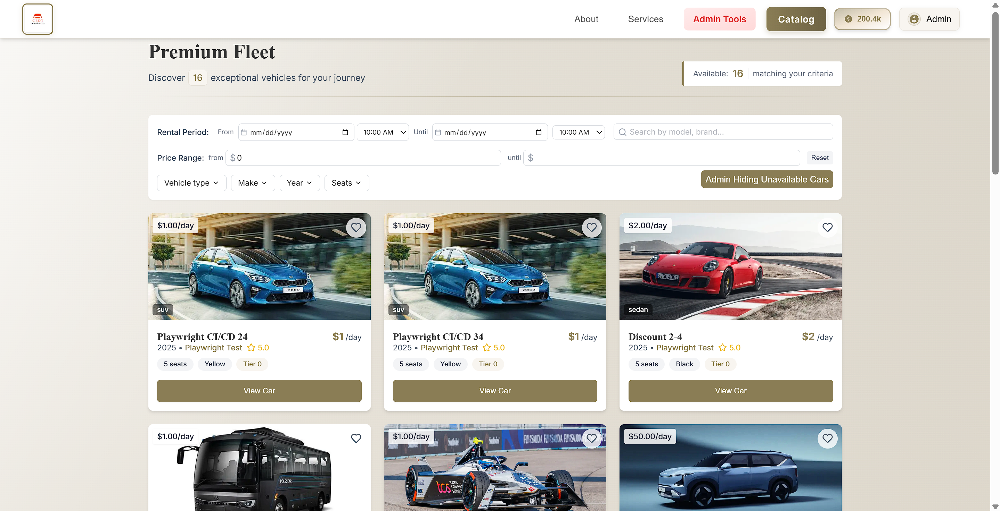  
  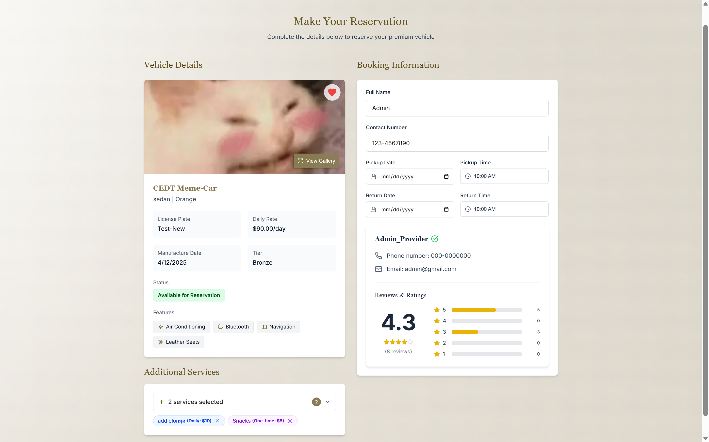  
  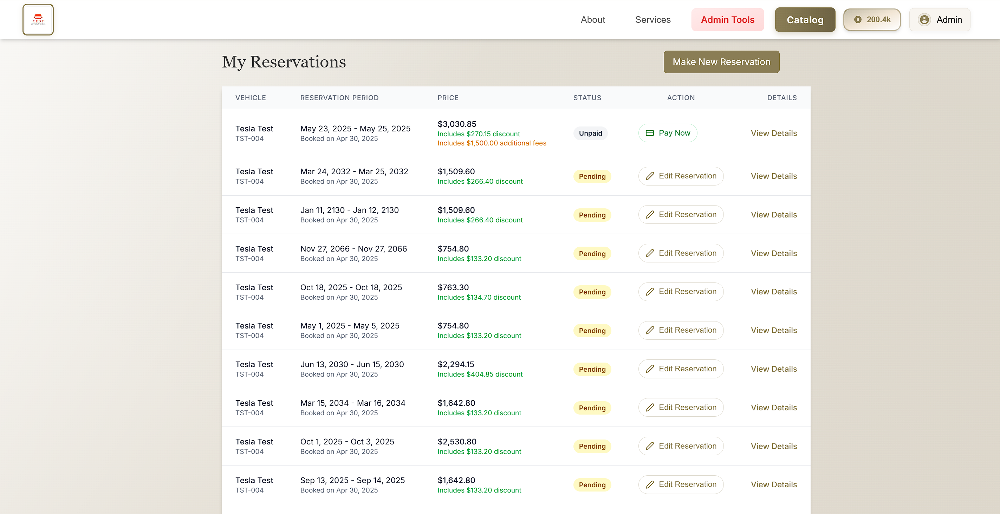  

  
Credit Pages

  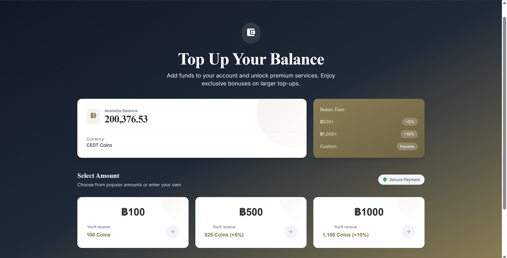  
  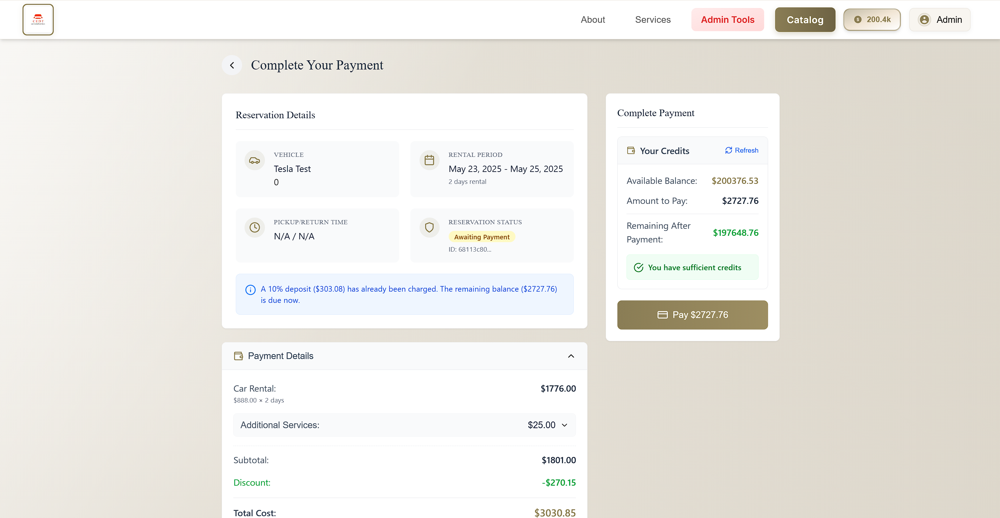  
  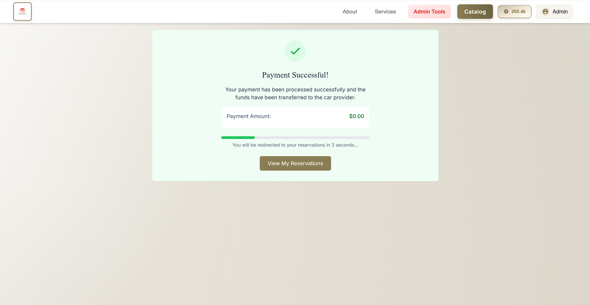  
  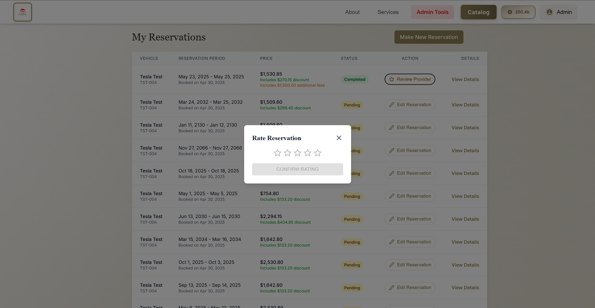  

  
Admin Pages

  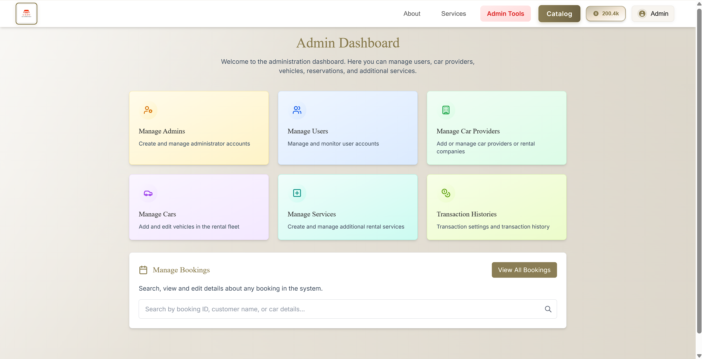  
  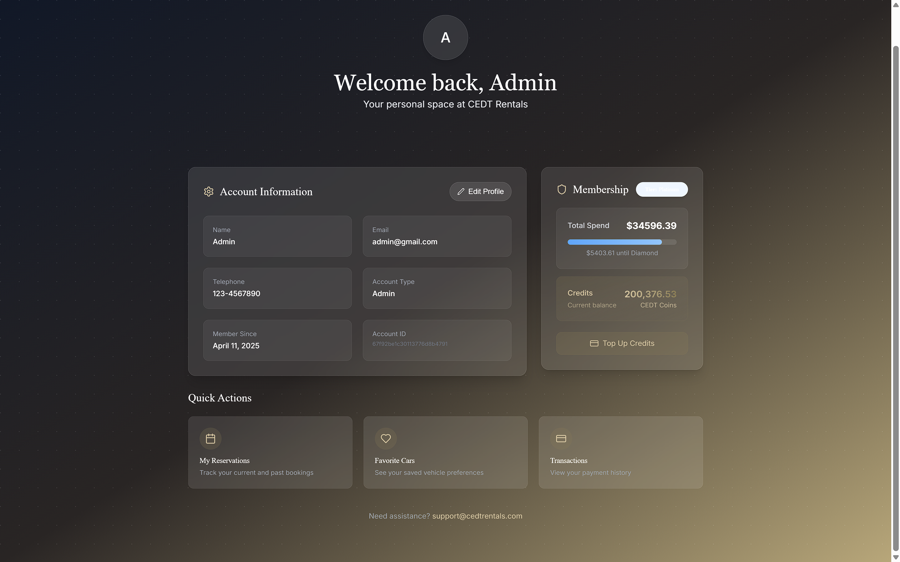  
  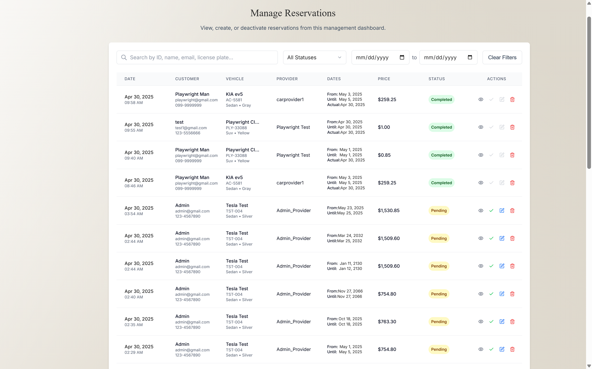  
  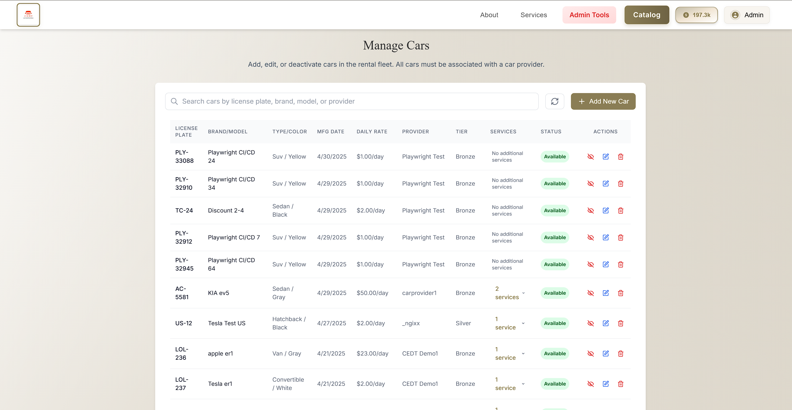  
  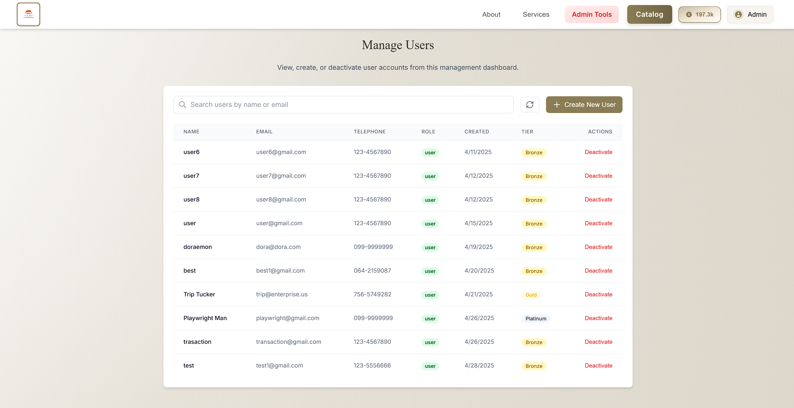  
  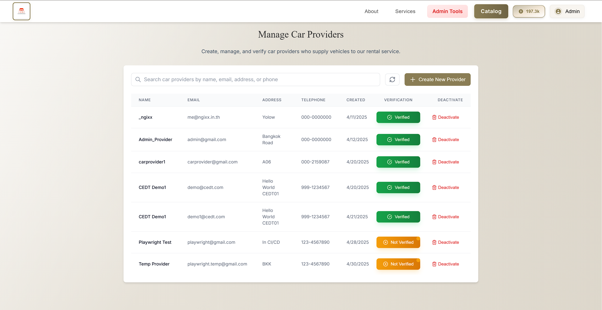  
  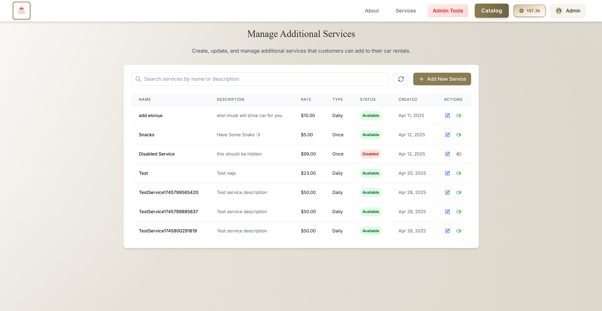  

  
Provider Pages

  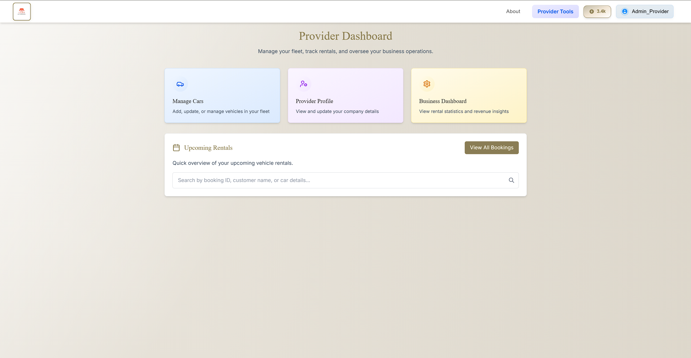  
  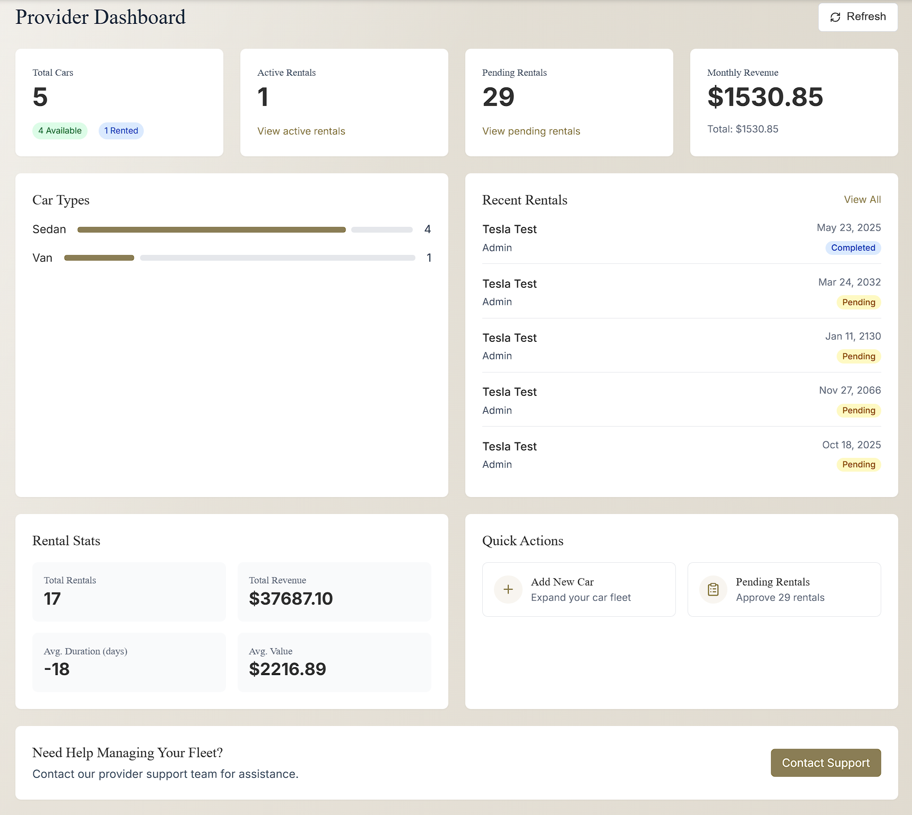  
  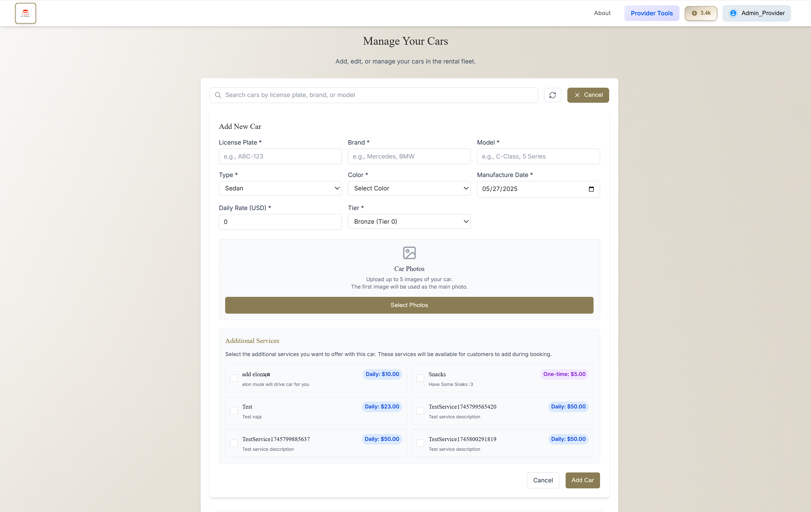  

## Credits  

This project was developed as part of the **2110423 Software Engineering curriculum** at **Chulalongkorn University**.  

### **Contributors**  
- **[Parinthorn Thammarux]**
- **[Supakorn Panyasodaban]**
- **[Watcharawit Pratpiamsuk]**
- **[Wasawat Junnasaksri]** 
- **[Phubest Srikoon]**
- **[Wasawat Junnasaksri]**
- **[Tanabodhi Mukura]** 
- **[Chanut Chansangavej]** 
- **[Thitithat Tiankrajang]** 
- **[Pisit Kanchanapinpong]** 

### **Special Thanks**  
- **Chulalongkorn University** for providing the course framework.  
- **Open-Source Libraries & Tools** used in development.  
- **Vercel** for hosting the frontend.  

---
